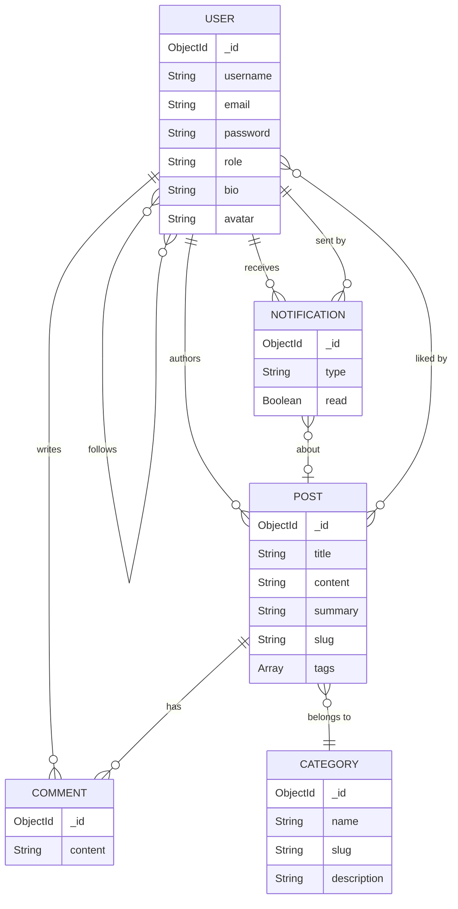

<div align="center">

# 🔵 Blue

### A Modern Multi-User Blog Platform

[](https://nodejs.org)
[](https://react.dev)
[](https://www.mongodb.com/atlas)
[](https://tailwindcss.com)
[](https://expressjs.com)

*Write. Share. Connect. A beautifully crafted blogging experience with the **Dracula Soft** dark theme.*

---

</div>

## ✨ Overview

**Blue** is a full-stack, multi-user blogging platform built with the **MERN stack** (MongoDB, Express, React, Node.js). It features a stunning **Dracula Soft** dark theme with glassmorphism effects, role-based access control, real-time notifications, and a modern writing experience — all wrapped in a premium UI that feels alive with subtle animations and glow effects.

> This isn't just another blog app. It's a platform designed to make every interaction feel intentional, from the soft-glow hover on a post card to the gradient shimmer on your profile avatar.

---

## 🎨 Design Philosophy

Blue uses the **Dracula Soft** color palette — a carefully curated set of colors that reduce eye strain while maintaining visual hierarchy:

| Token | Hex | Usage |
|-------|-----|-------|
| 🟣 Purple | `#bd93f9` | Primary actions, links, CTAs |
| 🩷 Pink | `#ff79c6` | Accents, likes, gradients |
| 🩵 Cyan | `#8be9fd` | Focus rings, highlights |
| 🟢 Green | `#50fa7b` | Success states |
| 🟠 Orange | `#ffb86c` | Warnings |
| 🔴 Red | `#ff5555` | Destructive actions, errors |
| ⬛ Background | `#282a36` | Page background |
| 🔲 Surface | `#343746` | Cards, modals, dropdowns |
| ⬜ Foreground | `#f8f8f2` | Text, icons |
| 🔵 Comment | `#6272a4` | Muted text, timestamps |

**Design features include:**
- 🪟 **Glassmorphism** navbar with `backdrop-blur` and translucent background
- ✨ **Soft-glow** hover effects on cards, buttons, and inputs
- 🌈 **Gradient** text and buttons (purple → pink, pink → cyan)
- 💀 **Skeleton** loading states with shimmer animations
- 📱 **Mobile-first** responsive design with hamburger menu
- 🎯 **Inter font** from Google Fonts for clean typography

---

## 🏗️ Architecture

```
blue/
├── client/                     # React 19 + Vite 7 frontend
│   ├── src/
│   │   ├── components/
│   │   │   ├── Navbar.jsx        # Glassmorphism nav + search + notifications
│   │   │   ├── Postcard.jsx      # Post preview card with glow hover
│   │   │   ├── PostForm.jsx      # Create/edit form with tags & categories
│   │   │   └── ProtectedRoutes.jsx # Auth guard using context
│   │   ├── context/
│   │   │   └── AuthContext.jsx   # Cookie-based auth state management
│   │   ├── pages/
│   │   │   ├── Home.jsx          # Hero + search + category filters + pagination
│   │   │   ├── Login.jsx         # Dracula-themed login with blur orbs
│   │   │   ├── Register.jsx      # Registration with auto-login
│   │   │   ├── PostDetails.jsx   # Full post + likes + comments
│   │   │   ├── CreatePost.jsx    # New post wrapper
│   │   │   ├── EditPost.jsx      # Edit post wrapper
│   │   │   ├── Profile.jsx       # User profile + follow/bio/stats
│   │   │   └── NotFound.jsx      # Styled 404 page
│   │   ├── App.jsx               # Route definitions
│   │   ├── App.css               # Dracula Soft design tokens & utilities
│   │   └── main.jsx              # Entry point with providers
│   ├── index.html                # SEO tags + Inter font
│   └── .env                      # VITE_API_URL
│
└── server/                     # Express 5 + Mongoose 8 backend
    ├── controllers/
    │   ├── authController.js     # Register, login, logout, getMe
    │   ├── postController.js     # CRUD + search + pagination + likes
    │   ├── commentController.js  # Add, list, delete comments
    │   ├── userController.js     # Profile, follow/unfollow, notifications
    │   └── categoryController.js # Admin-only create, list all
    ├── middleware/
    │   ├── authMiddleware.js     # JWT cookie verification + user check
    │   └── rbacMiddleware.js     # Role-based access control guard
    ├── models/
    │   ├── User.js               # username, email, role, bio, followers
    │   ├── Post.js               # title, content, slug, tags, category, likes
    │   ├── Comment.js            # post ref, author ref, content
    │   ├── Category.js           # name, slug, description
    │   └── Notification.js       # sender, recipient, type, read status
    ├── routes/
    │   ├── authRoutes.js         # /api/auth/*
    │   ├── postRoutes.js         # /api/posts/*
    │   ├── commentRoutes.js      # /api/comments/*
    │   ├── userRoutes.js         # /api/users/*
    │   └── categoryRoutes.js     # /api/categories/*
    ├── server.js                 # App entry — DB first, then listen
    └── .env                      # MONGO_URI, JWT_SECRET, CLIENT_URL
```

---

## 🚀 Features

### 🔐 Authentication & Authorization
- **JWT + httpOnly Cookies** — Secure, XSS-resistant token storage
- **Session Restoration** — `GET /api/auth/me` restores user state on page refresh
- **Role-Based Access Control (RBAC)** — Three roles with escalating permissions:

| Role | Create Posts | Edit/Delete Own | Manage Categories | Admin Panel |
|------|:-----------:|:---------------:|:-----------------:|:-----------:|
| **Reader** | ❌ | ❌ | ❌ | ❌ |
| **Author** | ✅ | ✅ | ❌ | ❌ |
| **Admin** | ✅ | ✅ (any post) | ✅ | ✅ |

- **Rate Limiting** — Auth routes limited to 20 requests per 15 minutes

### 📝 Blog Posts
- **Full CRUD** — Create, read, update, and delete posts
- **Markdown Content** — Write posts with Markdown formatting
- **Auto-Generated Slugs** — Clean URLs from post titles
- **Dynamic Categories** — Database-stored, admin-managed categories
- **Tag System** — Add/remove tags with a chip-based UI
- **Post Summaries** — Optional excerpt for post previews

### 🔍 Search & Discovery
- **Full-Text Search** — Search by title, content, or tags via `?q=`
- **Category Filters** — Filter posts by category from the home page
- **Author Filter** — View all posts by a specific author
- **Pagination** — Configurable page size with page navigation

### 💬 Social Features
- **Like/Unlike** — Toggle likes on posts with animated heart
- **Comments** — Add, view, and delete comments on posts
- **Follow/Unfollow** — Follow other authors to build your network
- **User Profiles** — Public profiles with bio, post count, follower stats
- **Inline Bio Editing** — Edit your bio directly from your profile page

### 🔔 Notifications
- **Polling-Based** — Notifications fetched on route changes
- **Unread Counter** — Badge count on the navbar bell icon
- **Mark as Read** — Bulk mark-all-read when opening dropdown
- **Notification Types:**
  - 👤 Someone followed you
  - 💬 Someone commented on your post
  - ❤️ Someone liked your post

---

## ⚡ Quick Start

### Prerequisites

- **Node.js** v18 or higher
- **npm** v9 or higher
- **MongoDB** — Local instance or [MongoDB Atlas](https://www.mongodb.com/atlas) (free tier)

### 1. Clone the Repository

```bash
git clone https://github.com/your-username/blue.git
cd blue
```

### 2. Set Up the Server

```bash
cd server
npm install
```

Create a `.env` file in the `server/` directory:

```env
MONGO_URI=mongodb+srv://<username>:<password>@cluster.mongodb.net/<dbname>
JWT_SECRET=your-super-secret-key-change-this-in-production
NODE_ENV=development
CLIENT_URL=http://localhost:5173
```

> ⚠️ **Security:** Never commit `.env` files with real credentials. Use a strong, unique `JWT_SECRET` in production.

### 3. Set Up the Client

```bash
cd ../client
npm install
```

Create a `.env` file in the `client/` directory:

```env
VITE_API_URL=http://localhost:5000
```

### 4. Run the Application

Open **two terminals**:

```bash
# Terminal 1 — Start the API server
cd server
npm run dev          # Starts on http://localhost:5000

# Terminal 2 — Start the React client
cd client
npm run dev          # Starts on http://localhost:5173
```

### 5. Open in Browser

Navigate to **[http://localhost:5173](http://localhost:5173)** — you should see the Dracula Soft themed home page.

---

## 📡 API Reference

### Authentication

| Method | Endpoint | Auth | Description |
|--------|----------|:----:|-------------|
| `POST` | `/api/auth/register` | ❌ | Create account + set cookie |
| `POST` | `/api/auth/login` | ❌ | Sign in + set cookie |
| `POST` | `/api/auth/logout` | ✅ | Clear auth cookie |
| `GET` | `/api/auth/me` | ✅ | Get current user from cookie |

### Posts

| Method | Endpoint | Auth | Description |
|--------|----------|:----:|-------------|
| `GET` | `/api/posts` | ❌ | List posts (paginated, searchable) |
| `GET` | `/api/posts/:id` | ❌ | Get single post |
| `POST` | `/api/posts` | ✅ | Create a new post |
| `PUT` | `/api/posts/:id` | ✅ | Update post (owner/admin) |
| `DELETE` | `/api/posts/:id` | ✅ | Delete post (owner/admin) |
| `PUT` | `/api/posts/:id/like` | ✅ | Toggle like/unlike |

**Query Parameters for `GET /api/posts`:**

| Param | Type | Example | Description |
|-------|------|---------|-------------|
| `q` | string | `?q=javascript` | Search title, content, tags |
| `category` | ObjectId | `?category=abc123` | Filter by category |
| `author` | ObjectId | `?author=def456` | Filter by author |
| `tag` | string | `?tag=react` | Filter by tag |
| `page` | number | `?page=2` | Page number (default: 1) |
| `limit` | number | `?limit=20` | Items per page (default: 10) |

### Comments

| Method | Endpoint | Auth | Description |
|--------|----------|:----:|-------------|
| `POST` | `/api/comments/:postId` | ✅ | Add comment to post |
| `GET` | `/api/comments/:postId` | ❌ | List comments for post |
| `DELETE` | `/api/comments/:id` | ✅ | Delete comment (owner/admin) |

### Users

| Method | Endpoint | Auth | Description |
|--------|----------|:----:|-------------|
| `GET` | `/api/users/:id` | ❌ | Get public profile |
| `PUT` | `/api/users/profile` | ✅ | Update own profile (bio, avatar) |
| `PUT` | `/api/users/:id/follow` | ✅ | Toggle follow/unfollow |
| `GET` | `/api/users/notifications` | ✅ | Get notifications |
| `PUT` | `/api/users/notifications/read` | ✅ | Mark all as read |

### Categories

| Method | Endpoint | Auth | Description |
|--------|----------|:----:|-------------|
| `GET` | `/api/categories` | ❌ | List all categories |
| `POST` | `/api/categories` | 🔒 Admin | Create category |

---

## 🛠️ Tech Stack

### Frontend
| Technology | Version | Purpose |
|-----------|---------|---------|
| React | 19 | UI framework |
| Vite | 7 | Build tool & dev server |
| TailwindCSS | 4 | Utility-first CSS |
| React Router DOM | 7 | Client-side routing |
| Lucide React | latest | Icon library |
| shadcn/ui primitives | latest | `class-variance-authority`, `clsx`, `tailwind-merge` |

### Backend
| Technology | Version | Purpose |
|-----------|---------|---------|
| Express | 5 | HTTP framework |
| Mongoose | 8 | MongoDB ODM |
| JSON Web Token | latest | Authentication tokens |
| bcrypt / bcryptjs | latest | Password hashing |
| cookie-parser | latest | Cookie handling |
| express-rate-limit | latest | Brute-force protection |
| slugify | latest | URL-friendly slugs |
| dotenv | 17 | Environment variables |

### Database
| Technology | Purpose |
|-----------|---------|
| MongoDB Atlas | Cloud-hosted NoSQL database |

---

## 🗄️ Database Schema



---

## 📜 Available Scripts

### Server (`/server`)

| Script | Command | Description |
|--------|---------|-------------|
| **dev** | `npm run dev` | Start with nodemon (auto-restart) |
| **start** | `npm start` | Start in production mode |

### Client (`/client`)

| Script | Command | Description |
|--------|---------|-------------|
| **dev** | `npm run dev` | Start Vite dev server |
| **build** | `npm run build` | Build for production |
| **preview** | `npm run preview` | Preview production build |
| **lint** | `npm run lint` | Run ESLint |

---

## 🔒 Security Considerations

| Risk | Mitigation |
|------|-----------|
| XSS via stolen tokens | JWT stored in `httpOnly` cookies (not accessible via JS) |
| CSRF | `SameSite` cookie attribute + CORS origin restriction |
| Brute-force login | Rate limiting: 20 requests per 15-minute window |
| Injection attacks | Mongoose ODM handles sanitization; input validation on controllers |
| Credential leakage | `.env` files in `.gitignore`; never commit secrets |

> **Production Checklist:**
> - [ ] Use a strong, random `JWT_SECRET` (min 32 characters)
> - [ ] Set `NODE_ENV=production`
> - [ ] Enable HTTPS
> - [ ] Set `secure: true` and `sameSite: 'strict'` on cookies
> - [ ] Rotate MongoDB Atlas credentials

---

## 🤝 Contributing

1. **Fork** the repository
2. **Create** a feature branch: `git checkout -b feature/amazing-feature`
3. **Commit** your changes: `git commit -m 'Add amazing feature'`
4. **Push** to the branch: `git push origin feature/amazing-feature`
5. **Open** a Pull Request

---

## 📄 License

This project is open source and available under the [MIT License](LICENSE).

---

<div align="center">

**Built with 💜 using the MERN Stack**

*Dracula Soft Theme · Glassmorphism · Soft-Glow Effects*

</div>
